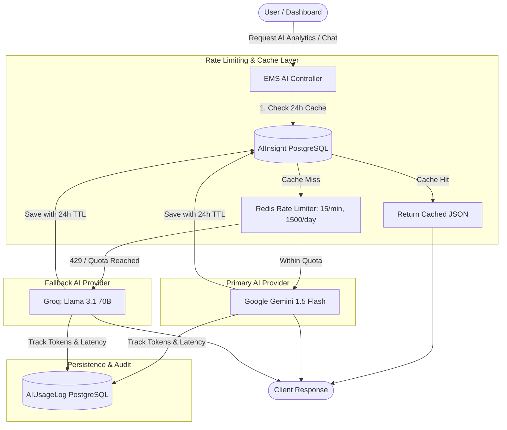

# Free AI Integration Architecture (Google Gemini 1.5 Flash + Groq Fallback)

## 🌟 1. Overview & Architecture

The Employee Management System (EMS) integrates enterprise-grade AI capabilities at **zero subscription cost** using the **Google Gemini Free Tier** (`gemini-1.5-flash`), backed by 24-hour database caching, distributed Redis rate limiting, asynchronous BullMQ queues, and an optional **Groq** (`llama-3.1-70b-versatile`) fallback layer.



---

## 🔑 2. Obtaining Free API Keys

### Google Gemini API Key (100% Free)
1. Go to [Google AI Studio](https://aistudio.google.com/).
2. Sign in with your Google account.
3. Click **"Get API key"** -> **"Create API key in new project"**.
4. Copy the generated key and add it to `backend/.env`:
   ```env
   GEMINI_API_KEY=AIzaSy...
   ```

### (Optional) Groq Fallback API Key (100% Free)
1. Navigate to [Groq Console](https://console.groq.com/).
2. Create an API key under **API Keys**.
3. Add to `backend/.env`:
   ```env
   GROQ_API_KEY=gsk_...
   ```

---

## ⚡ 3. Free Tier Limits & Rate Limit Protection

| Metric | Google Gemini Free Tier | EMS Mitigation Strategy |
| :--- | :--- | :--- |
| **Requests Per Minute (RPM)** | **15 RPM** | Redis sliding window counter (`ai:ratelimit:min:{timestamp}`). Throttles bursts gracefully. |
| **Requests Per Day (RPD)** | **1,500 RPD** | Atomic daily counter (`ai:ratelimit:day:{YYYY-MM-DD}`). Midnight cron reset. |
| **Tokens / Minute (TPM)** | **1,000,000 TPM** | Compact prompt templates requesting strictly structured JSON. |
| **Cost** | **₹0.00 / $0.00** | 24-hour cache layer in `ai_insights` table avoids redundant AI calls. |

---

## 🧠 4. AI Subsystem Capabilities

### 1. Employee Performance Intelligence (`GET /api/v1/ai/employees/:id/performance`)
Aggregates 30-day attendance logs, completed task velocity, and review history to generate performance ratings, strength highlights, and actionable managerial recommendations.

### 2. Personalized Improvement Plans (`GET /api/v1/ai/employees/:id/improvement-plan`)
Creates targeted 3-month milestone-based professional development plans with KPIs and mentorship milestones.

### 3. Predictive Attrition Analysis (`GET /api/v1/ai/employees/:id/attrition`)
Evaluates tenure, leave frequency anomalies, overtime intensity, and role growth to predict attrition risk probability (`LOW`, `MEDIUM`, `HIGH`).

### 4. Predictive Attendance & Shift Forecasting (`GET /api/v1/ai/attendance/prediction`)
Models historical shift coverage and upcoming national holidays to forecast attendance percentages and highlight peak absenteeism risk windows.

### 5. Anomaly & Security Detection (`GET /api/v1/ai/anomalies`)
Audits shift clock-ins and payroll logs to detect suspicious geolocation shifts or irregular time punches.

### 6. Interactive EMS AI Assistant (`POST /api/v1/ai/chat`)
Conversational assistant capable of answering questions regarding organization policies, leave balances, payroll deductions, and workflow approvals.

### 7. Strategic Business Optimization (`GET /api/v1/ai/recommendations`)
Delivers high-impact, low-effort organizational optimization recommendations across cost, scheduling, and retention.

---

## 💾 5. Database Schema

### `ai_insights` (24h Cache Table)
```prisma
model AIInsight {
  id          String    @id @default(uuid())
  companyId   String?
  employeeId  String?
  userId      String?
  insightType String
  period      String?
  prompt      String?   @db.Text
  content     Json
  rawResponse String?   @db.Text
  model       String    @default("gemini-1.5-flash")
  tokensUsed  Int       @default(0)
  expiresAt   DateTime
  createdAt   DateTime  @default(now())
  updatedAt   DateTime  @updatedAt

  @@index([companyId, insightType])
  @@index([employeeId, insightType])
  @@index([expiresAt])
  @@map("ai_insights")
}
```

### `ai_usage_logs` (Telemetry & Cost Audit)
```prisma
model AIUsageLog {
  id               String   @id @default(uuid())
  companyId        String?
  userId           String?
  provider         String   @default("gemini")
  model            String   @default("gemini-1.5-flash")
  action           String
  promptTokens     Int      @default(0)
  completionTokens Int      @default(0)
  totalTokens      Int      @default(0)
  latencyMs        Int      @default(0)
  status           String   @default("SUCCESS")
  errorMessage     String?
  createdAt        DateTime @default(now())

  @@index([companyId, createdAt])
  @@index([provider, createdAt])
  @@map("ai_usage_logs")
}
```

---

## 🧪 6. Testing & Validation

### Test AI Usage & Quota API:
```bash
curl -H "Authorization: Bearer <JWT_TOKEN>" http://localhost:5000/api/v1/ai/usage-stats
```

### Test Interactive Chat:
```bash
curl -X POST http://localhost:5000/api/v1/ai/chat \
  -H "Authorization: Bearer <JWT_TOKEN>" \
  -H "Content-Type: application/json" \
  -d '{"message": "What is the policy for applying casual leave?"}'
```

### Test Company Analytics:
```bash
curl -H "Authorization: Bearer <JWT_TOKEN>" http://localhost:5000/api/v1/ai/analytics/company
```

---

## 🛡️ 7. Privacy & Security Best Practices
- **No Direct PII Leakage**: Prompts summarize metrics without exposing passwords, financial account numbers, or government IDs (Aadhaar/PAN).
- **Tenant Isolation**: Queries strictly enforce `companyId` boundaries.
- **RBAC Enforcement**: Predictive attrition and anomaly detection require `COMPANY_ADMIN` or `HR_ADMIN` role permissions.
