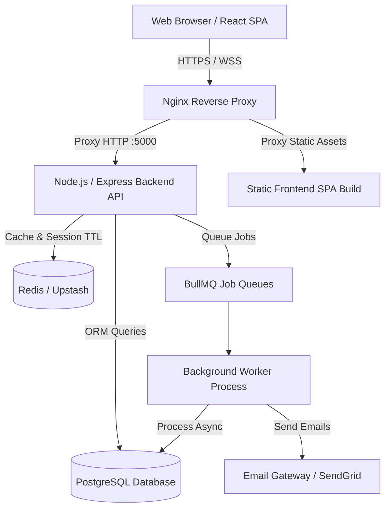

# System Architecture & High-Level Design

## Key Architectural Highlights
1. **Modular Domain Structure**: 28 decoupled feature modules in `backend/src/modules/`.
2. **Asynchronous Task Architecture**: 6 dedicated BullMQ queues handling email dispatch, notification delivery, biometric hardware synchronization, reports generation, payroll execution, and subscription dunning.
3. **Multi-Tenant Scoping**: All database operations are partitioned by `companyId`.
4. **Resilient Cache Layer**: Intelligent Redis response caching with automatic invalidation.
